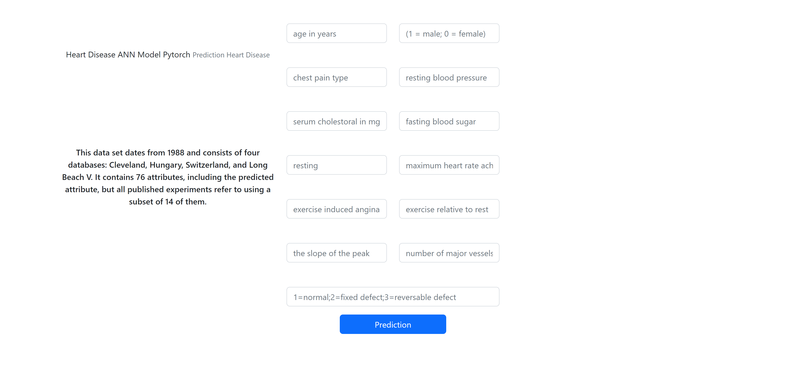
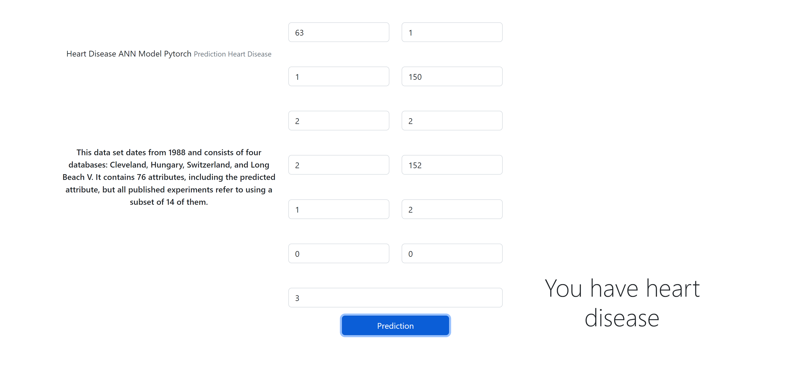

# deep-learning-heart-disease-predition-web-app
AI model for prediction heart disease web app (pytorch , flask , python)
# about model 
- pytorch
- ANN
- python 
- html
- flask

# model predict web page 🤩
- 13 input
- 1 output 😎

 | 
 
# prediction 

# how run model 😎
- Download All Requirements
- run 'python hd_flask.py' in cmd
- http://127.0.0.1:5000/hdisease open in your browser
- enter inputs
- and get predition 😎😉
